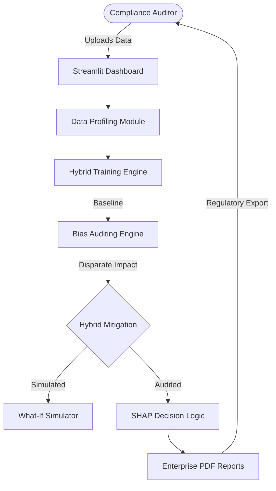

# LoanGuard AI: Enterprise Fairness Audit & Bias Mitigation Pipeline

[](https://share.streamlit.io/)
[](https://opensource.org/licenses/MIT)

**LoanGuard AI** is a premium, enterprise-grade platform designed to audit, detect, and mitigate algorithmic bias in financial decision systems. It ensures your AI models remain compliant with global regulations (**ECOA, GDPR, EU AI Act**) while maintaining peak predictive performance.

---

## 🚀 Key Modules & Capabilities

### 1. 🛡️ Hybrid Bias Mitigation Engine (Dual-Strategy)
The system employs a unique **Dual-Layer Logic** to optimize fairness:
- **Pre-processing (Reweighing)**: Balances historical data bias before training.
- **In-processing (Exponentiated Gradient)**: Enforces strict parity constraints during training to guarantee demographic alignment.

### 2. 🎮 Interactive "What-If" Analysis Simulator
A live sandbox where compliance officers can:
- Input any applicant's profile (Income, Credit, Age, Gender).
- Instantly compare the **Biased Baseline** decision against the **Fairness-Corrected** outcome.
- Stress-test the model's sensitivity in real-time.

### 3. 🔍 Deep Model Explainability (SHAP)
Powered by advanced game theory, this module provides:
- **Feature Impact Analysis**: Reveals exactly how much each variable (e.g., Credit Score) drives the final decision.
- **SHAP Density Plots**: Visualizes model dependence on sensitive attributes to detect "hidden" proxy variables.

### 4. 🏛️ Automated Compliance Dossiers (Audit-Ready)
Generate professional, high-fidelity PDF and Markdown reports featuring:
- **Audit Remark System**: Human-readable explanations for every rejection (e.g., *"Insufficient Revenue Path (Below INR 40k)"*).
- **Comprehensive Applicant Roster**: A granular audit trail of every processed application.
- **Statistical Variance Charts**: Side-by-side performance vs. fairness trade-off monitoring.

---

## 🏗️ Technical Architecture



---

## 🛠️ Sidebar Modules in Detail

- **📊 Overview**: Real-time status of your compliance pipeline.
- **📦 Data Management**: Smart profiling and cleaning of financial datasets.
- **📈 Model Training**: Baseline establishment via Random Forest or Logistic Regression.
- **⚖️ Bias Analysis**: Multi-metric evaluation of demographic parity and disparate impact.
- **⚙️ Mitigation Engine**: Applying state-of-the-art fairness algorithms.
- **🔬 Performance vs. Fairness**: Precise trade-off charts for business decision-making.
- **🕵️ Explainability (SHAP)**: Individual and global decision transparency.
- **🏗️ What-If Simulator**: Real-time stress testing of loan logic.
- **📄 Compliance Reports**: Generating the final audit dossier with rejection remarks.

---

## 🛠️ Core Infrastructure & Tech Stack

- **Machine Learning**: `scikit-learn` — The cornerstone for model training, dataset splitting, and performance evaluation.
- **Fairness Stack**: `Fairlearn` & `AIF360` — Industrial-grade bias detection and mitigation algorithms.
- **Explainability**: `SHAP` — Game-theory based decision transparency.
- **Frontend & Visuals**: `Streamlit`, `Plotly`, & `Matplotlib` — Premium dashboarding and HD statistical charting.
- **Data Engine**: `Pandas` & `NumPy` — High-speed financial data processing and profiling.
- **Reporting**: `fpdf2` — Automated generation of enterprise-grade PDF audit dossiers.

---

## 💻 Quick Start

### Installation

1. **Clone the repository:**
   ```bash
   git clone https://github.com/Prakash-Ramakrishnan110/Loan-project.git
   cd Loan-project
   ```

2. **Set up environment & dependencies:**
   ```bash
   python -m venv venv
   source venv/bin/activate  # On Windows: venv\Scripts\activate
   pip install -r requirements.txt
   ```

3. **Launch the platform:**
   ```bash
   streamlit run app.py
   ```

---

## ⚖️ License

Project is licensed under the MIT License - see the [LICENSE](LICENSE) file for details.
